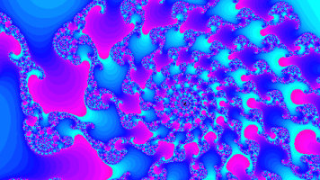
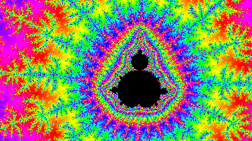
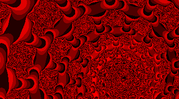
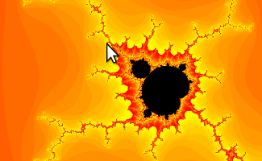
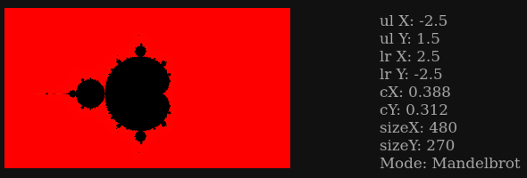
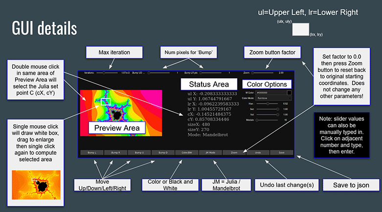

# PYNQ Juliabrot Fractal Factory
## A Xilinx FPGA accelerated near real-time interactive Python Jupyter Lab Notebook
## Compatible with the Avnet PYNQ ZUBoard 1CG, Avnet PYNQ Ultra96 v1/v2 and Xilinx PYNQ Z1/Z2 development boards

**To demonstrate potential, several full-rez up to 16K sized images are available: [click here](https://bit.ly/3lBTm1S)**

The U96 board execution is faster than the ZUBoard 1CG & Z1/Z2 but otherwise the features are the same for both platforms.

 

 

**Setup and installation:**

* **Install PYNQ v3.0.1 or newer on your ZUBoard 1CG, Ultra96 or PYNQ Z1/Z2 board**
   * SD images and instructions can be found here: http://www.pynq.io
* **(For PYNQ Z1/Z2 board only), open a PYNQ board console:**
   * Use `ssh xilinx@<your board IP address>` (default password 'xilinx') OR
   * Open Jupyter Lab's root console
      * `http://<your board IP address>/lab`
      * If requested, enter `xilinx` for the default password
      * Click the Terminal Icon to open a console

      * Enter the commands below in the console to complete the installation, installing ipycanvas will take a while.

         ``` shell
         sudo pip3 install ipycanvas
         ```
      * **Next, install the notebook itself**

         ``` shell
         cd $PYNQ_JUPYTER_NOTEBOOKS
         git clone https://github.com/FredKellerman/pynq-juliabrot
         cd pynq-juliabrot
         git checkout origin/master
         ```

* If not already open, in your browser go to `http://<your board IP address>/lab`
* Use the Jupyter Lab Folder/File Explorer and under the folder `pynq-juliabrot` open `juliabrot-zoom.ipynb`
* Execute the notebook
* After executing `jui.draw_roaming_ui()` you should see:



* Use mouse click to start selection, click again to compute area within selection
* Enjoy!



## Mandelbrot / Julia FPGA Compute Engine Attributes  

Up to 16K x 16K grid sizes  
Max Iterations up to 4,294,967,296

| juliabrot Overlay   | Precision | N Kernels | Logic MHz | # DSP48s |
| --- | --- | --- | --- | --- |
| 96b          | 64-bits  | 6 | 300MHz | 300 |
| 96b_mid      | 95-bits  | 4 | 300MHz | 320 |
| 96b_deep     | 160-bits | 1 | 214MHz | 248 |
| z1 (z2 also) | 64-bits  | 3 | 125MHz | 150 |
| ZUBoard 1CG  | 90-bits  | 3 | 250MHz | 216 |

**Note: at this time the Python front end used for initial conditions only supports up to 80-bit precision, future plans are to remove this limitation.  Due to dev board memory limitations, images larger than 4K for coloring and formating should be completed off target on a PC.**  

The author would like to thank Github users @francof2a, @martinRenou for their kind replies and awesome contributions to the Open Source community.

https://github.com/martinRenou/ipycanvas

https://github.com/francof2a/fxpmath
