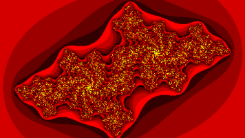

# PYNQ Juliabrot Fractal Factory
## A Xilinx FPGA accelerated near real-time interactive Python Jupyter Lab Notebook
## Compatible with the Avnet PYNQ Ultra96 v1/v2 and Xilinx PYNQ Z1/Z2 development boards
U96 execution is faster than the Z1/Z2 but otherwise the features are the same for both platforms.

 


**Setup and installation:**

* **Install PYNQ on your Ultra96 or Z1/Z2 board**
   * SD images and instructions can be found here: http://www.pynq.io
* **Open a PYNQ board console:**
   * Use `ssh xilinx@<your board IP address>` (default password 'xilinx') OR
   * Open Jupyter Lab's root console
      * `http://<your board IP address>/lab`
      * If requested, enter `xilinx` for the default password
      * Click the Terminal Icon to open a console

Enter the commands below in the console to complete the installation, installing ipycanvas will take a while.

* **Install ipycanvas (must use v0.4.7)**

``` shell
sudo pip3 install ipycanvas==0.4.7
sudo jupyter labextension install @jupyter-widgets/jupyterlab-manager ipycanvas@0.4.7 --no-build
sudo jupyter lab build --minimize=False
sudo jupyter labextension install ipycanvas@0.4.7 --minimize=False

```

* **Next, install the notebook itself**

``` shell
cd $PYNQ_JUPYTER_NOTEBOOKS
git clone https://github.com/FredKellerman/pynq-juliabrot
cd pynq-juliabrot
git checkout origin/master

```

* **Before using the new notebook you must reboot**

```shell
sudo reboot

```

* If you used the Jupyter Lab console for setup, after rebooting **you must refresh your web browser before proceeding**
* If not already open, in your browser go to `http://<your board IP address>/lab`
* Use the Jupyter Lab Folder/File Explorer and under the folder `pynq-juliabrot` open `local-juliabrot-zoom.ipynb`
* Execute the notebook
* After executing `jui.draw_roaming_ui()` you should see:


* Use mouse click to start selection, click again to compute area within selection
* Enjoy!

The author would like to thank Github users @francof2a, @martinRenou for their kind replies and awesome contributions to the Open Source community.

https://github.com/martinRenou/ipycanvas

https://github.com/francof2a/fxpmath

Thank you Adam Taylor @ATaylorCEngFIET for being the first official user.
